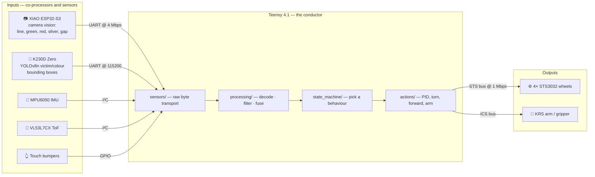
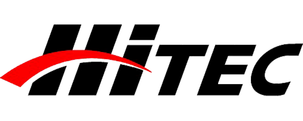
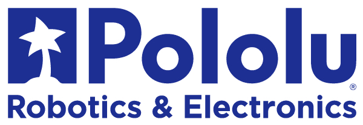
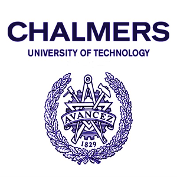

# RoboCupJunior Rescue Line — Robot


Firmware, vision, AI training pipeline, and electronics for team **FATEN**'s [RoboCupJunior Rescue Line](https://junior.robocup.org/rescue/) robot. The robot follows a line course, handles gaps, obstacles, and intersections, then enters an evacuation zone where it detects, grabs, and carries victims using an onboard YOLO(formerly MobileNet-SSD-v2-Lite) model.

**🌐 Team website:** [faten-1tdj.vercel.app](https://faten-1tdj.vercel.app/en/index.html)
**📸 Competition photos and videos(2026):** [Google Drive folder](https://drive.google.com/drive/folders/1ek6edaTA_Ugfu6BttLYHi5sbRvwh5g2C)

<!-- TODO: add a photo of the robot here

-->

## How the robot works

One microcontroller drives the robot; two smart co-processors pre-digest the camera data so the control loop stays fast and deterministic. The Teensy never touches raw pixels — it only receives small, decoded messages.



The Teensy firmware is a strict 5-layer architecture (`drivers → sensors → processing → state_machine/actions`) where calls only flow downward, with one file pair per state-machine state (`LINE_Follow`, `LINE_Gap`, `LINE_Obstacle`, `EVAC_Entry`, `EVAC_SearchDeploy`, `EVAC_Exit`, …). See [teensy/STS-imuMerge/README.md](teensy/STS-imuMerge/README.md) and the interactive [system map](Docs/architecture.html) for the full picture.

## Hardware

| Part | Role |
|---|---|
| Teensy 4.1 | Main controller: sensor fusion, state machine, motion control |
| Seeed XIAO ESP32-S3 Sense | Line-camera co-processor: line position, green/red markers, silver tape, gap detection |
| Sipeed CanMV K230D Zero | AI co-processor: YOLOv8n victim / colour detection (kmodel via nncase) |
| MPU6050 | IMU — pitch / roll / yaw |
| VL53L7CX | Multizone ToF — walls and obstacle distance |
| 4× Feetech STS3032 | Serial-bus wheel servos (1 Mbps) |
| Kondo KRS servos & Hitech HS45HB | Victim arm and grippers |
| Custom PCBs (EasyEDA) | Power distribution, adapters, breakouts — see [electronics/](electronics/) |

## Repository layout

| Directory | Contents |
|---|---|
| [teensy/](teensy/) | Teensy 4.1 firmware. **`STS-imuMerge/` is the competition firmware**; other folders are hardware bring-up tests (IMU, STS servos, touch) |
| [xiaoesp/](xiaoesp/) | XIAO ESP32-S3 camera firmware (`XIAOdev/`) + Web Serial debug viewer (`esp32_camera_viewer.html`) |
| [k230-final-train/](k230-final-train/) | **Current** YOLOv8n training pipeline: dataset → train → ONNX → kmodel → simulate → compare → deploy, all in Docker, one script per step |
| [k230-inference/](k230-inference/) | MicroPython code that runs on the K230D (CanMV): live detection, UART protocol to the Teensy |
| [k230/](k230/) | Legacy training pipeline + datasets (superseded by `k230-final-train/`) |
| [electronics/](electronics/) | EasyEDA projects, 3D exports, KiCad archive |
| [Docs/](Docs/) | Interactive HTML docs — open in a browser (see below) |
| [dev-tools/](dev-tools/) | Flashing images, servo manager, drivers, terminal tools |

## Documentation

The `Docs/` folder holds self-contained HTML documents (open locally in any browser):

- [architecture.html](Docs/architecture.html) — full system map: co-processors, 5-layer firmware, state machine, PID
- [APIs.html](Docs/APIs.html) — inter-board protocols and APIs
- [mapping-overview.html](Docs/mapping-overview.html) — mapping / pose overview
- [hardware530_design_upgrade.html](Docs/hardware530_design_upgrade.html), [hardware530_parts_upgrade.html](Docs/hardware530_parts_upgrade.html) — hardware upgrade notes
- [k526_PTQ_model_compare.html](Docs/k526_PTQ_model_compare.html) — kmodel post-training-quantization comparison

Each firmware layer also documents itself: every `src/<layer>/` folder has its own `README.md` with that layer's rules.

## Building and running

### Teensy firmware

Requires [Teensyduino](https://www.pjrc.com/teensy/teensyduino.html) (Arduino IDE or `arduino-cli` with the `teensy:avr` core):

```powershell
cd teensy/STS-imuMerge
arduino-cli compile --fqbn "teensy:avr:teensy41:usb=serial,speed=600,opt=o2std,keys=en-us" --build-path build .
```

### XIAO camera firmware

Build profile is pinned in [sketch.yaml](xiaoesp/XIAOdev/sketch.yaml) (esp32 core 3.3.7):

```powershell
cd xiaoesp/XIAOdev
arduino-cli compile --profile xiaoesp32s3
```

### K230D AI co-processor

1. Flash the CanMV MicroPython image (`CanMV_K230D_Zero_micropython_v1.5-legacy … nncase_v2.9.0`, in [dev-tools/](dev-tools/)) — see [k230-inference/README.md](k230-inference/README.md)
2. Copy the contents of [k230-inference/](k230-inference/) plus your `.kmodel` to the device SD card

### Training a new model

Fully reproducible in Docker — annotated dataset in, deployable `.kmodel` out:

```powershell
cd k230-final-train
.\competition_run.ps1 -Name victim_v2 -Epochs 100
```

See [k230-final-train/README.md](k230-final-train/README.md) for the step-by-step scripts and the PTQ search/compare workflow. Note: kmodels must be converted with **nncase 2.9.0-compatible tooling** to match the flashed CanMV firmware.

## Acknowledgements

### Sponsors

Team FATEN thanks the sponsors who made this robot possible:

<p>
  <a href="https://easyeda.com/"></a>&nbsp;&nbsp;&nbsp;
  <a href="https://jlcpcb.com/"></a>&nbsp;&nbsp;&nbsp;
  <a href="https://keeppower.com/"></a>&nbsp;&nbsp;&nbsp;
  <a href="https://hitecrcd.com/"></a>&nbsp;&nbsp;&nbsp;
  <a href="https://www.pololu.com/"></a>
</p>

- **[EasyEDA](https://easyeda.com/) & [JLCPCB](https://jlcpcb.com/)** — provided the PCB design software and board fabrication credit; the integrated design-to-manufacture workflow carried our boards smoothly from schematic to delivered PCB.
- **[Keeppower](https://keeppower.com/)** — supplied high-spec protected batteries, with the protection circuit custom-designed for our robot, and covered most of the battery and shipping costs.
- **[Hitec](https://hitecrcd.com/)** — provided motors for the robot arm along with battery chargers and maintenance jigs; their high-spec LiFePO4 balance charger kept our batteries reliably charged throughout the competition.
- **[Pololu](https://www.pololu.com/)** — supported the team's sensor hardware, including the VL53L7CX multizone time-of-flight sensor the robot uses for wall and obstacle detection.

More photos from the competition are in our [Google Drive folder](https://drive.google.com/drive/folders/1ek6edaTA_Ugfu6BttLYHi5sbRvwh5g2C).

### Institutions

Our team members represent:

<p>
  <a href="https://www.nyu.edu/"></a>&nbsp;&nbsp;&nbsp;
  <a href="https://www.columbia.edu/"></a>&nbsp;&nbsp;&nbsp;
  <a href="https://www.chalmers.se/en/"></a>
</p>

### Open source

This robot builds on Ultralytics YOLOv8, nncase, CanMV, Teensyduino, and the Arduino ESP32 core.

## License

This project is licensed under the **Creative Commons Attribution-NonCommercial 4.0 International License (CC BY-NC 4.0)** — see [LICENSE](LICENSE) for details.

In short: you're welcome to **study this project, learn from it, and build your own work on top of it**, as long as you **credit team FATEN** (a link back to this repository) and **don't use it for commercial purposes**. Please don't just lift the code wholesale — use it as a reference and make it your own.

Third-party components (YOLOv8, nncase, CanMV, Teensyduino, the Arduino ESP32 core, etc.) remain under their own licenses.
